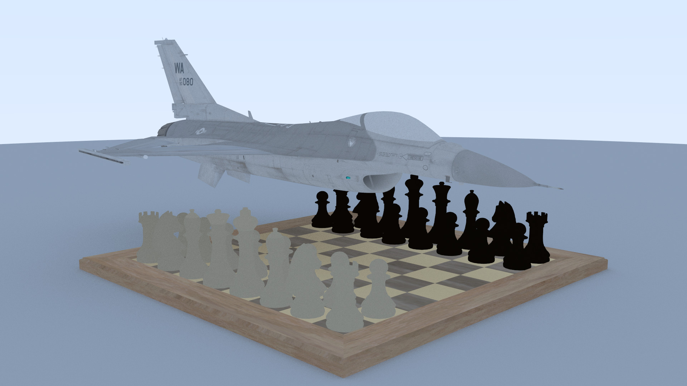

# CPPRayTracer

A ray tracer with no dependencies built in C++.

## Key features

- Uses Bounding Volume Hierarchy (BVH) to speed up to cull faces to speed up rendering.
- A custom ThreadPool implementaion to allow for parallel rendering of tiles to speed up rendering.
- Ability to load and render .obj files with support for image textures in the .mtl format

